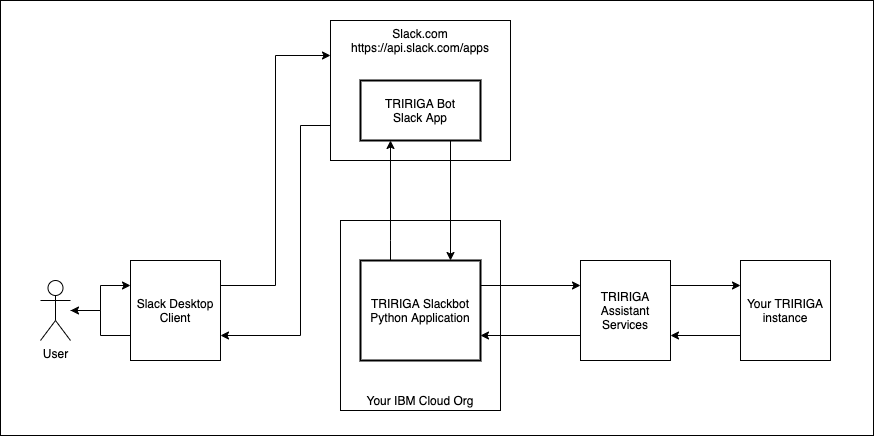
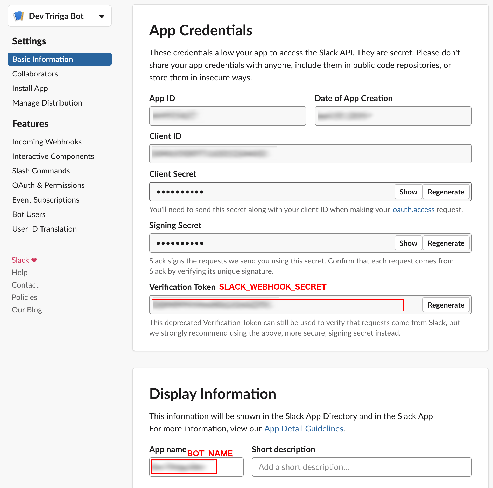
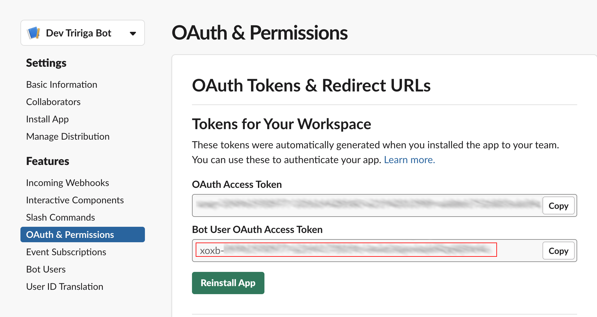

 
 

 
 

# TRIRIGA Assistant Slackbot

In this code pattern, we will create a Slack app using Python, Docker, Kubernetes on IBM Cloud, and TRIRIGA Assistant.  The code provided will guide you in adding a Slack app to your Slack Workspace that will allow your TRIRIGA users to perform Workplace Service functionality through Slack utilizing the Watson Assistant add-on to TRIRIGA.

When you have completed this code pattern, you will understand more about:

* Defining a Slack app
* Deploying applications in Kubernetes
* Provisioning a TRIRIGA Assistant
* Capabilities of the TRIRIGA Assistant

## A. Requirements
The following are required to use this software:

1. An [IBM TRIRIGA](https://www.ibm.com/products/tririga) instance that is accessible via the internet

2. Importing and performing setup steps for [TRIRIGA Assistant](https://github.com/IBM/tririga-assistant) which includes provisioning of TRIRIGA Assistant Services by the IBM AI Applications - TRIRIGA Voice Enablement team.

6. Access to a Slack workspace with privileges to create Slack applications.

4. Docker for deploying in Kubernetes Service: [Windows](https://docs.docker.com/docker-for-windows/install/), [Mac](https://docs.docker.com/docker-for-mac/install/), [Getting Started](https://www.docker.com/get-started)

5. [ngrok](https://ngrok.com/download) for local testing

6. An IBM Cloud account

## B. Configuration

### Environment Variables
Tririga-Bot has a handful of environment variables that need to be set. 

First, copy the `sample.env` file to `.env`.

Edit the `.env` file and provide the following information:

#### App Configurations
- `PORT` - the port the application will respond to.
- `API_KEY` - a key needed to prevent unwanted access to this app.  This can be anything you wish.

#### Slack Settings
To complete the Slack Settings you need to create a slack app using Slack UI at `https://api.slack.com/apps`. 
- `BOT_NAME` is the name you gave your bot in slack
- `SLACK_WEBHOOK_SECRET` is the verification token slack sends with every request to your bot

- `SLACK_BOT_USER_TOKEN` is the OAuth token for your bot to use to access slack

- `OAuth & Permissions`
    - `Scopes` add the following `Bot Token Scopes`
        - 'app_mentions:read'
        - 'channels:history'
        - 'chat:write'
        - 'chat:write.customize'
        - 'im:history'
        - 'im:read'
        - 'im:write'
        - 'reactions:read'
        - 'users:read'
- `Event Subscriptions`
    - `Enable Events` should be ON 
    - `Request URL` should be '\<URL to bot>/slack' (when running locally, this will be the `https://xxx.ngrok.io/slack` URL. See NGROK section below.)
    - `Subscribe to Bot Events` add the following events
        - 'message.channels'
        - 'message.im'
- `Interactive Components`
    - `Interactivity` should be ON
    - `Request URL` should be '\<URL to bot>/slack/handle_action'
    
#### TRIRIGA Assistant Settings
- `TA_INTEGRATION_ID` - the Integration ID provided by the IBM AI Applications - TRIRIGA Voice Enablement Team.

#### Watson Assistant Settings
Optionally, you can connect this slackbot to a Watson Assistant created in your own Watson Assistant Service. The following information can be found on the Assistant's Settings page after creating the Assistant in your Watson Assistant Service.  Note, without a Skill provided by the IBM AI Applications - TRIRIGA Voice Enablement Team, connecting the Slackbot to Watson Assistant will not access data in TRIRIGA.
- `WA_IAM_KEY` - The Service Credentials Api Key.
- `WA_ASSISTANT_ID` - The Assistant ID.

## C. Testing Locally

##### 1. Start NGROK

    $ ngrok http 8080

##### 2. Update both `Request URL` in Slack settings

##### 3. Build the image using Docker CLI 

    $ docker build .

##### 4. Start the app using build ID from previous command
    
    $ docker run --env-file .env -p 8080:8080 YOUR_BUILD_ID_HERE
    
##### 5. Talk to the bot through slack

Direct Message the bot with `hi` to start a conversation.
    
    
## D. Deployment

### Deploy as a cloud foundry application on IBM Cloud
Prerequisites: [IBM Cloud CLI](https://cloud.ibm.com/functions/learn/cli)

##### 1. Copy the `yaml/sample.manifest.yml` to `manifest.yml` and provide values as in `.env` file.

##### 2. Push the code as a cloud foundry application using the following command.

    $ ibmcloud cf push my-tririga-bot -f manifest.yml
    
##### 3. Get the URL for the cloud foundry application

    $ ibmcloud cf app my-tririga-bot
   
##### 4. Update both Request URLs in Slack  

### Deploy as a service in IBM Cloud Kubernetes Service (IKS)
The [Deploy to IBM Cloud Kubernetes Service Getting Started Guide](https://github.com/IBM-Cloud/get-started-python/blob/master/README-kubernetes.md) should be very helpful in this process as well as [IBM Cloud Kubernetes Overview](https://cloud.ibm.com/kubernetes/overview).

##### 1. Push the Docker image to IBM Cloud Registry (ICR) by tagging the Docker build and pushing to ICR.  Replace `us.icr.io` with the container registry domain in your region.

    $ ibmcloud cr namespace-add tririga-bot

    $ docker tag YOUR_BUILD_ID_HERE us.icr.io/tririga-bot/my-tririga-bot:1
    
    $ docker push us.icr.io/tririga-bot/my-tririga-bot:1

##### 2. Create a cluster in IKS

    $ ibmcloud ks cluster create classic --name my-tririga-bot
    
    $ ibmcloud ks cluster config --cluster my-tririga-bot
    
##### 3. Copy `yaml/sample.deployment.yml` to `deployment.yml` and provide values as in `.env` file as well as registry domain.

##### 4. Start the app in cluster

    $ kubectl create -f deployment.yml
   
##### 5. Check the status of the deployment and get further details if deployment fails
    
    $ kubectl get pods
    
    $ kubectl describe pod my-tririga-bot
    
If having trouble getting Kubernetes to pull the image, see this [help document on Image Pull Secrets](https://cloud.ibm.com/docs/containers?topic=containers-registry#imagePullSecret_migrate_api_key)
   
##### 6. Expose port when app is running

    $ kubectl expose deployment my-tririga-bot --type NodePort --port 8080 --target-port 8080

##### 7. Get real port number from `NodePort` value

    $ kubectl describe service my-tririga-bot
    
##### 8. Get `Public IP` address for app

    $ ibmcloud ks workers --cluster my-tririga-bot
   
##### 9. Update both Request URLs in Slack using following template 

    http://<Public-IP>:<NodePort>/slack
    http://<Public-IP>:<NodePort>/slack/handle_action
   
## Built With
* [IBMCloud](https://www.ibm.com/cloud) - Service provider and application hosting environment
* [Watson Assistant](https://cloud.ibm.com/catalog/services/watson-assistant) - NLU service for understanding user intent and other bot inputs.
* [Slack Apps](https://api.slack.com/apps) - The API and framework for communicating to and from Slack
* [IBM TRIRIGA](https://www.ibm.com/us-en/marketplace/ibm-tririga) - Facility management software solution by IBM

## Versioning
We use [SemVer](http://semver.org/) for versioning. For the versions available, see the [tags on this repository](https://github.ibm.com/ConsumerIoT/tririga-bot/tags). 

## License
This project is licensed under the MIT License - see the [LICENSE](LICENSE) file for details
